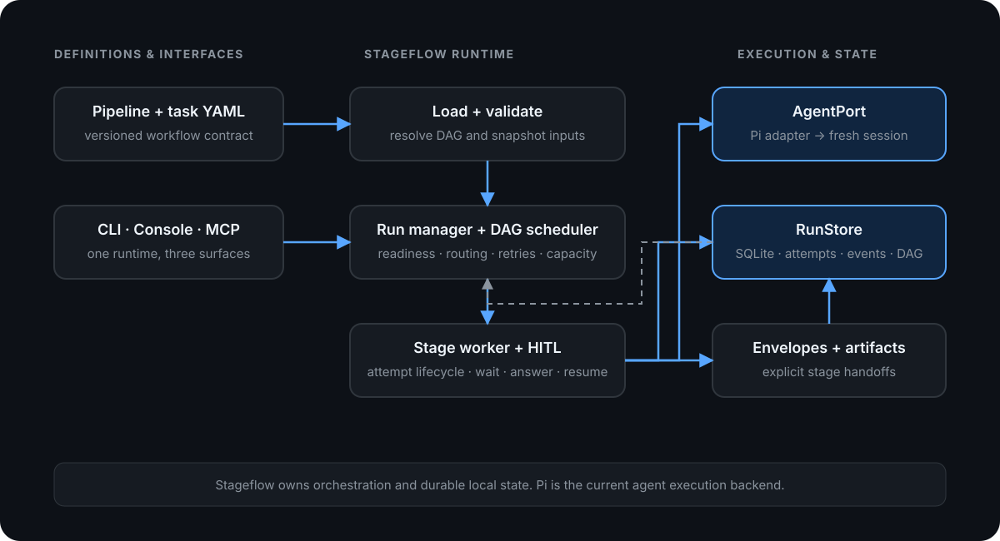

# Architecture

Stageflow is a local-first runtime for configurable multi-stage agent workflows. It separates **workflow orchestration** from **agent execution**: Stageflow owns the pipeline graph, scheduling, persisted state, handoff contracts, retries, human gates, and operator interfaces; Pi is the current agent execution backend behind `AgentPort`.

## System boundaries



| Component | Responsibility | Primary code |
|---|---|---|
| Config loader | Load and validate manifests, tasks, stages, and resolved pipeline DAGs | `src/config/` |
| Run manager | Start/resume coordination, run capacity, checkout leases, retries, startup reconciliation | `src/runtime/runManager.ts` |
| DAG scheduler | Readiness, bounded parallelism, routing, fan-out/join, clone instances, failure propagation | `src/runtime/pipelineScheduler.ts` |
| Stage runtime | Build attempt context, open the agent, record activity, validate completion, coordinate gates | `src/runtime/stageRunner.ts`, `src/runtime/stageAttemptBootstrap.ts` |
| Agent boundary | Stable stage input/result and live wait-or-complete session contract | `src/agent/port.ts` |
| Pi adapter | Translate Stageflow stage execution into Pi coding-agent sessions and tools | `src/agent/` |
| Persistence | Store run metadata, DAG snapshots, attempts, events, envelopes, artifacts, and projections | `src/runstore/` |
| Operator surfaces | Drive and inspect the same runtime through CLI, browser console, or MCP | `src/cli/`, `src/server/`, `src/mcp/`, `ui/` |

## Execution flow

1. **Load and validate.** Stageflow resolves the selected pipeline and task, validates stage references and graph wiring, and resolves the checkout root.
2. **Create the durable run record.** The runtime persists the task input, pipeline path, resolved DAG snapshot, checkout metadata, and a per-run workspace before scheduling work.
3. **Schedule ready stages.** The DAG scheduler derives readiness from predecessor states and completed envelopes. Independent nodes can run concurrently up to configured per-run and process limits.
4. **Open an isolated stage attempt.** In the default process mode, a stage worker opens a fresh agent session with the task, stage instructions, predecessor envelope data, and scoped workspace paths.
5. **Record activity.** Logs and lifecycle events are appended to the run store while the stage works. Artifacts are written inside the run workspace instead of being embedded into transcripts.
6. **Validate the handoff.** A successful stage emits a `StageEnvelope`. Stageflow validates its status, summary, artifacts, optional payload schema, and routing fields before downstream stages consume it.
7. **Route or wait.** The envelope may select conditional successors or create clone instances. If the agent calls `ask_operator`, the stage parks as `waiting_for_input` until an answer is delivered through the console, MCP, or another supported operator path.
8. **Continue, retry, or finish.** The scheduler advances newly ready nodes, skips unreachable branches, invalidates affected downstream state during retry, and derives the final run outcome from persisted stage state.

## Handoff contract

Agent stages do not pass their full conversation histories to successors. They cross the boundary through a structured envelope:

```ts
type StageEnvelope = {
  status: "success" | "failure";
  summary: string;
  artifacts: string[];
  payload?: Record<string, unknown>;
  fork_choice?: string[];
  clone_forks?: CloneForkItem[];
  stage_id?: string;
  notes?: string;
};
```

The envelope is the control-plane handoff; artifacts are the data-plane handoff. A join stage can receive multiple predecessor envelopes without scraping or replaying their transcripts.

## Persistence and recovery

SQLite is the active `RunStore` adapter. State lives under `<git-root>/.stageflow/`, with per-run and per-attempt workspaces under `.stageflow/runs/`.

Stageflow persists:

- run metadata and a snapshot of the resolved DAG;
- stage attempts and lifecycle events;
- terminal envelopes and artifact paths;
- pending operator prompts and session context needed to resume a parked stage;
- projections used by the console and MCP resources.

Persisted state lets the runtime reconstruct scheduler state for HITL resume and targeted retries. On process startup, Stageflow reconciles runs whose workers disappeared rather than silently treating them as active. This is local durable state, not a claim of distributed exactly-once execution.

## Human-in-the-loop lifecycle

`AgentPort.openStage()` returns a live `StageHandle`. The runtime pulls either a completion or a `waiting_for_input` event. A waiting attempt is parked without converting the prompt into an unstructured failure. When the operator answers, Stageflow reconstructs the run context, reopens the saved agent session, delivers the opaque answer, and continues the remaining DAG.

This same lifecycle supports interactive console use and headless automation: CI exits with code `2` when a run requires input, while MCP clients can discover waiting gates and answer them programmatically.

## Design decisions

### Fresh session per stage

Each stage starts with an intentional context boundary. This prevents an ever-growing shared transcript from becoming hidden workflow state and makes inputs reviewable. The tradeoff is that pipeline authors must decide what belongs in the envelope, payload, or artifacts.

### Explicit envelopes over transcript scraping

Downstream behavior depends on validated fields instead of prose conventions inside another agent's chat history. This enables schema validation, fork routing, joins, CI extraction, and retry reasoning. The tradeoff is a stricter completion protocol for stage authors.

### Pipeline-owned YAML

Workflow topology and stage configuration live with the consuming project, where they can be reviewed and versioned. Stageflow validates structure but does not hard-code domain-specific stage types. YAML favors reproducibility over fully dynamic, agent-invented orchestration.

### Orchestration behind ports

`AgentPort` keeps scheduling and persistence code independent of Pi-specific session mechanics. `RunStore` similarly keeps runtime call sites behind a persistence contract, even though SQLite is currently the only live adapter. These boundaries are extension seams, not promises that additional backends already exist.

### Local-first operator control

The CLI, local console, and MCP server operate on the same run model. This keeps local and CI behavior aligned and makes stage state inspectable without introducing a hosted control plane. Stageflow is not currently a multi-tenant distributed orchestrator.

## Runtime invariants

- A stage becomes ready only when its required predecessors reach compatible terminal states.
- A successor consumes validated envelopes, not arbitrary predecessor transcripts.
- Run and stage lifecycle state is persisted before it is projected to operator surfaces.
- Waiting is a first-class state and is distinct from failure.
- Retries create new attempts and recompute affected downstream execution rather than rewriting prior history.
- The CLI, console, and MCP host drive the same runtime contracts.

## Related documentation

- [YAML catalog](yaml-catalog.md) — pipeline, stage, task, fork, and clone configuration
- [Envelopes](envelopes.md) — handoff schema, payload validation, and artifact rules
- [Human-in-the-loop](hitl.md) — gate kinds, waiting behavior, and resume paths
- [CI / headless](ci.md) — JSON output, exit codes, and GitHub Actions
- [MCP](mcp.md) — tools and run resources
- [Operator console](operator-console.md) — runtime inspection and gate handling
